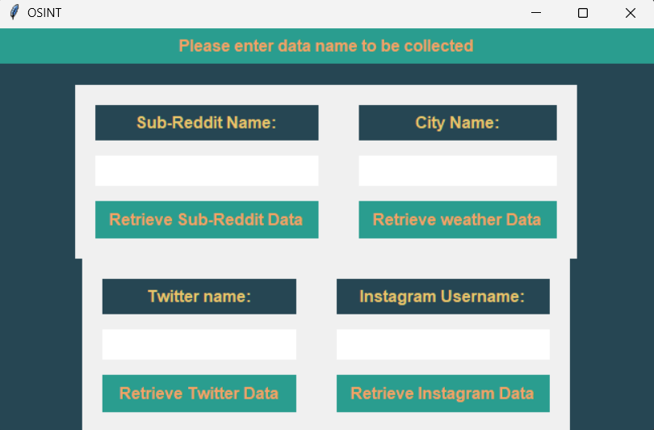

# Python Application

This script is a comprehensive data collection tool using a graphical user interface (GUI) built with Tkinter. It interacts with several online platforms—Twitter, Instagram, Reddit, and a weather API—to fetch and save relevant data based on user input.

## Features

- **Instagram Details:** Users can input an Instagram username to retrieve details such as username, profileImage, full name, follower count, bio, following count, total posts, private status.

- **Weather Report:** Users can input a city name to retrieve details about the weather of their city, this includes weather condition, temperature, humudity, wind speed and pressure.

- **Twitter Details:** Similar to Instagram, users can input a Twitter username to fetch details such as screen name, real name, follower count, following count, and total tweets.

- **Sub-Reddit Details:** Users can input a sub-reddit username/id to retrieve details such as username, subscribers, total posts, total comments, and the list of recent sub-reddit posts and comments.

##### Note: All the information above will be saved in their respective file based on the name they enter. 

## Requirements

- Python >=3.8.0

## Setup

**Install Dependencies:**

        pip install pandas
        pip install tqdm
        pip install instaloader
        pip install ntscraper
        pip install praw
  
## Images

#### Output of the generated files can be seen inside of Testing Example Files folder

**Run the Application:**
##### Open the terminal where file is placed and run the command 

        python application.py 

## Usage
###### Note: . All the files for respective for details are being created where application.py is located. 
1. **Instagram Details:**
- Enter an Instagram username in the provided input field and click the "Retrieve" button.
- View the retrieved user details and recent post details from the file saved.

2. **Weather report:**
- Enter a city name in the provided input field and click the "Retrieve" button.
- View the retrieved city weather report from the .txt file.

3. **Twitter Details:**
- Enter a Twitter username in the provided input field and click the "Retrieve" button.
- View the retrieved user details from the .csv file.

4. **Sub-Reddit Details:**
- Enter a sub-reddit username/id in the provided input field and click the "Retrieve" button.
- View the retrieved user details and recent sub-reddit post details.

